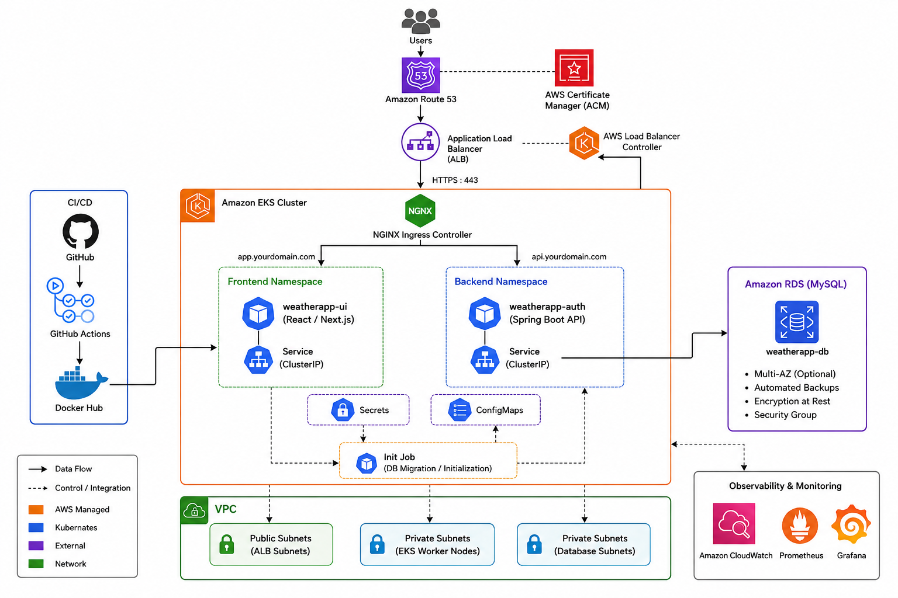
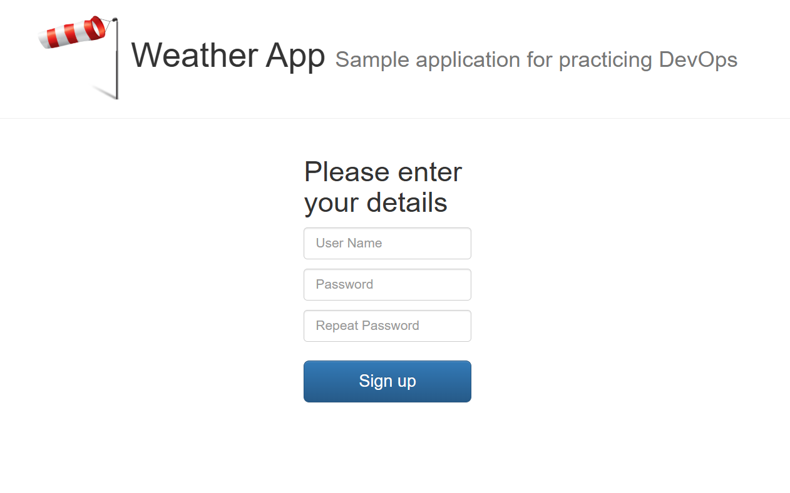

# 🌦️ Weather App End-to-End DevOps Project

## 📌 Overview

This project demonstrates a complete End-to-End DevOps workflow on AWS.

The infrastructure is provisioned using Terraform, the applications are containerized with Docker, deployed on Amazon EKS using Kubernetes, secrets are managed with AWS Secrets Manager and External Secrets Operator, monitoring and logging are implemented using Amazon CloudWatch, and CI/CD is automated using GitHub Actions.

The application consists of two microservices:

- **UI Service** (Express.js)
- **Authentication Service** (Go)
- **weather service** (python)
---

# 🚀 Architecture



---

# 🏗️ Architecture Overview

```
                        GitHub
                           │
                           │ Push
                           ▼
                   GitHub Actions
                           │
          ┌────────────────┴───────────────┐
          │                                │
          ▼                                ▼
 Build UI Docker Image          Build Auth Docker Image
          │                                │
          └──────────────┬─────────────────┘
                         ▼
                     Docker Hub
                         │
                         ▼
                     Amazon EKS
               ┌─────────┴─────────┐
               │                   │
               ▼                   ▼
          UI Pod              Auth Pod
               │                   │
               └─────────┬─────────┘
                         ▼
                  Amazon RDS MySQL

External Secrets Operator
        │
        ▼
AWS Secrets Manager

CloudWatch Container Insights
CloudWatch Logs
CloudWatch Alarms
```

---

# ☁️ AWS Services Used

- Amazon VPC
- Amazon EKS
- Amazon EC2
- Amazon RDS MySQL
- AWS IAM
- AWS Secrets Manager
- Amazon CloudWatch
- Amazon SNS

---

# 🛠️ Technologies

- Terraform
- Docker
- Docker Hub
- Kubernetes
- Helm
- Express.js
- Go
- MySQL
- GitHub Actions
- AWS CLI
- kubectl

---

# 📂 Project Structure

```text
.
├── authentication/                # Go authentication service
│
├── ui/                            # Express UI service
│
├── aws_infra/
│   ├── infrastructure/            # Terraform Infrastructure
│   └── repo_ecr/                  # Terraform configuration (optional if still used)
│
├── kubernetes/
│   ├── authentication/
│   ├── ui/
│   ├── ingress/
│   ├── external-secrets/
│   └── monitoring/
│
├── .github/
│   └── workflows/
│       └── cicd.yml
│
└── README.md
```

---

# ⚙️ Infrastructure

Terraform provisions the following AWS resources:

- VPC
- Public Subnets
- Private Subnets
- Internet Gateway
- NAT Gateway
- Route Tables
- Security Groups
- Amazon EKS Cluster
- Managed Node Group
- Amazon RDS MySQL
- IAM Roles
- IAM Policies
- OIDC Provider
- AWS Secrets Manager

---

# 🐳 Microservices

## UI Service

Technology:

- Express.js

Responsibilities:

- Serves the frontend
- Communicates with Authentication Service

Dockerized and deployed on Kubernetes.

---

## Authentication Service

Technology:

- Go

Responsibilities:

- Authentication APIs
- Database connectivity
- Reads credentials from AWS Secrets Manager

Dockerized and deployed on Kubernetes.

---

# ☸️ Kubernetes Resources

The project deploys:

- Namespace
- Deployment
- Service
- Ingress
- ConfigMap
- Secret
- ExternalSecret
- ClusterSecretStore
- Job

---

# 🔐 Secret Management

Sensitive credentials are stored in **AWS Secrets Manager**.

External Secrets Operator synchronizes secrets from AWS Secrets Manager into Kubernetes Secrets using **IAM Roles for Service Accounts (IRSA)**.

Flow:

```
AWS Secrets Manager
        │
        ▼
ClusterSecretStore
        │
        ▼
ExternalSecret
        │
        ▼
Kubernetes Secret
        │
        ▼
Application Pods
```

---

# 🐳 Containerization

Each service has its own Dockerfile.

Docker images are automatically built and pushed to **Docker Hub**.

Example repositories:

- docker.io/redasobhy/weather-ui
- docker.io/redasobhy/weather-auth

---

# 🚀 CI/CD Pipeline

GitHub Actions automatically performs the following steps:

1. Checkout repository
2. Build UI Docker image
3. Build Authentication Docker image
4. Login to Docker Hub
5. Push Docker images to Docker Hub
6. Update Kubernetes Deployments

Pipeline Flow:

```
Developer

      │

      ▼

Git Push

      │

      ▼

GitHub Actions

      │

      ▼

Docker Build

      │

      ▼

Docker Hub

      │

      ▼

Amazon EKS
```

---

# 📊 Monitoring & Logging

Monitoring is implemented using **Amazon CloudWatch**.

Features:

- EKS Control Plane Logs
- Container Insights
- Pod Logs
- Node Metrics
- Cluster Metrics
- CloudWatch Alarms

Metrics include:

- CPU Utilization
- Memory Utilization
- Network Usage
- Pod Count
- Node Health

Logs are collected from:

- Kubernetes Pods
- Worker Nodes
- EKS Control Plane

---

# 🗄️ Database

Amazon RDS MySQL is used as the backend database.

Features:

- Private Subnets
- Security Groups
- Automated provisioning using Terraform

---

# 🌐 Networking

Infrastructure includes:

- VPC
- Public Subnets
- Private Subnets
- Internet Gateway
- NAT Gateway
- Route Tables
- Security Groups

---

# 🐳 Docker Hub

Docker images are stored in Docker Hub.

Example repositories:

- docker.io/redasobhy/weather-ui
- docker.io/redasobhy/weather-auth

Images are automatically pushed by GitHub Actions after every successful build.

---

# 🔐 IAM

IAM is configured for:

- EKS Cluster
- Worker Nodes
- External Secrets Operator (IRSA)

---

# 📈 CloudWatch

The project enables:

- EKS Control Plane Logging
- Container Insights
- CloudWatch Metrics
- CloudWatch Logs

Future improvements:

- SNS Notifications
- CloudWatch Dashboard
- CloudWatch Alarms

---

# 📋 Prerequisites

Before deploying the project, install:

- Terraform
- Docker
- kubectl
- Helm
- AWS CLI
- Git

Configure AWS credentials:

```bash
aws configure
```

---

# 🚀 Deployment

## Clone Repository

```bash
git clone https://github.com/reda-sobhy/Weather-App-End-To-End-DevOps-Project.git
```

---

## Deploy Infrastructure

```bash
cd aws_infra/infrastructure

terraform init

terraform plan

terraform apply
```

---

## Configure kubectl

```bash
aws eks update-kubeconfig \
--region us-east-1 \
--name my-eks
```

---

## Deploy Kubernetes Resources

```bash
kubectl apply -f kubernetes/
```

---

## Verify Deployment

```bash
kubectl get pods -A

kubectl get svc -A

kubectl get ingress
```

---

# 📸 Screenshots

Add screenshots here.

## Architecture

```

```

---

## EKS Cluster

```
docs/eks.png
```

---

## Kubernetes Pods

```
docs/pods.png
```

---

## GitHub Actions

```
docs/github-actions.png
```

---

## CloudWatch

```
docs/cloudwatch.png
```

---

## Application




---

# 📌 Future Improvements

- ArgoCD (GitOps)
- Prometheus
- Grafana
- Horizontal Pod Autoscaler (HPA)
- Karpenter
- AWS Load Balancer Controller
- Trivy Image Scanning
- SonarQube Code Analysis
- Slack Notifications

---

# 👨‍💻 Author

**Reda Sobhy**

GitHub:
https://github.com/reda-sobhy


---

# ⭐ Support

If you found this project useful, consider giving it a ⭐ on GitHub.
